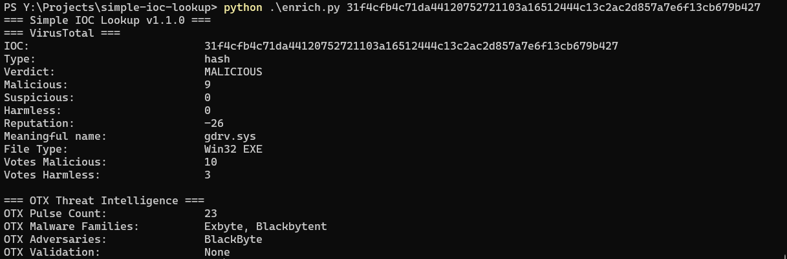
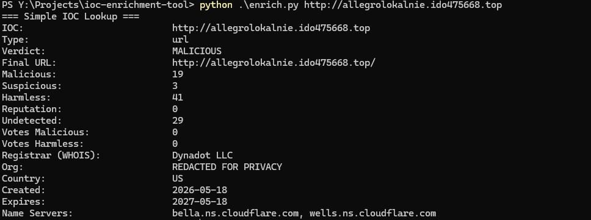
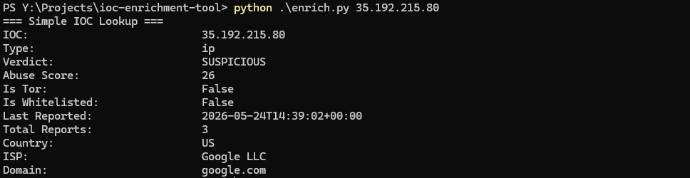
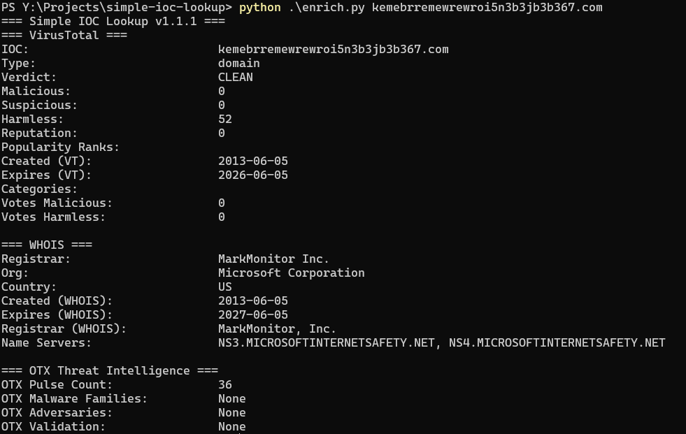

## Simple IOC Lookup

A Python-based IOC enrichment tool that performs automated triage of IPs, domains, URLs, and file hashes.

## Usage
Windows:
```
python enrich.py <ioc>
```
Linux/Mac:
```
python3 enrich.py <ioc>
```
JSON output:
```
python enrich.py <ioc> --output json
```
Pipe to file:
```
python enrich.py <ioc> --output json > result.json
```

Tested using Python 3.10.11

## Requirements
```
pip install -r requirements.txt
```

## API Keys

This tool uses the following free APIs:
- VirusTotal: https://www.virustotal.com (free account required)
- AbuseIPDB: https://www.abuseipdb.com (free account required)
- AlienVault OTX: https://otx.alienvault.com (free account recommended)

**Note: VirusTotal free tier is limited to 4 requests per minute. Allow 15 seconds between lookups to avoid rate limiting.**


URL and hash analysis will be skipped if keys are not present. OTX enrichment will be skipped if OTX_API_KEY is not present.


Add keys to a `.env` file in the project directory:
```
VT_API_KEY=your_key_here
ABUSEIPDB_API_KEY=your_key_here
OTX_API_KEY=your_key_here
```

## Features
- IOC type detection (URL, IP, hash, domain)
- VirusTotal URL enrichment
- VirusTotal hash enrichment
- AbuseIPDB IP enrichment
- Domain enrichment
- WHOIS lookup for domain and URL IOC types
- AlienVault OTX enrichment for all IOC types (pulse count, malware families, adversary associations)

## Sample Output

**Hash Lookup**


**URL Lookup**


**IP Lookup**
  

**Domain Lookup**


## How It Works

1. Detects the IOC type automatically (URL, IP, hash, or domain)
2. Routes to the appropriate enrichment APIs based on type
3. URL and domain lookups include WHOIS registration data
4. Returns a verdict based on vendor detections and abuse scores

| IOC Type | APIs Used |
|----------|-----------|
| URL      | VirusTotal, WHOIS, OTX |
| IP       | AbuseIPDB, OTX |
| Hash     | VirusTotal, OTX |
| Domain   | VirusTotal, WHOIS, OTX |

## MITRE ATT&CK

This tool supports investigation of the following techniques:

- T1566 — Phishing (URL and domain triage)
- T1071 — Application Layer Protocol (domain and URL analysis)
- T1204 — User Execution (malicious hash identification)
- T1190 — Exploit Public-Facing Application (IP reputation lookup)


## Sample Data
Test IOCs sourced from publicly available phishing and malware feeds.

## Code Quality
- Type checked with mypy
- Unit tested with unittest

## Version
1.1.0

## Author: Philip Zangara

## License: MIT

Disclaimer: Built independently, with AI used as a learning aid for guidance and debugging feedback.
